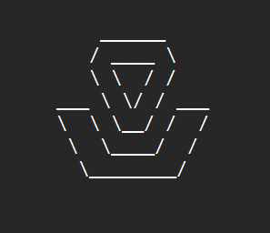

2025-09-07    
# Adventure Team 

-----------------------------------
[](https://github.com/adv-superuser/adv.github.io/actions/workflows/ci.yaml) [](https://badge.fury.io/rb/jekyll-theme-dinky)    

```
~/adv.github.io/README.md
```


WIP - Ruby Gems
---------------

*Plan to use [Midnight](http://pages-themes.github.io/midnight) or [Dinky](http://pages-themes.github.io/dinky) Jekyll theme for the GitHub Pages.*
